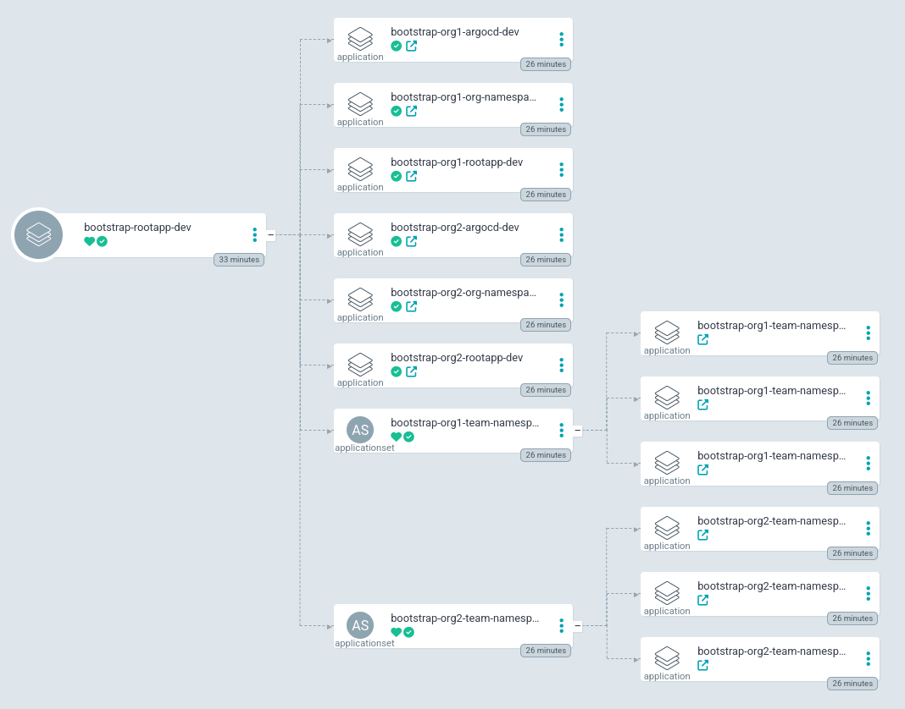
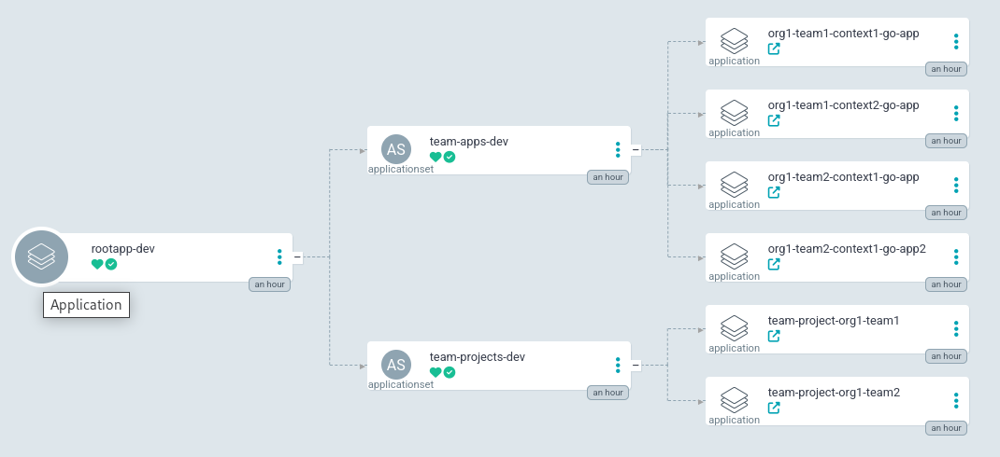
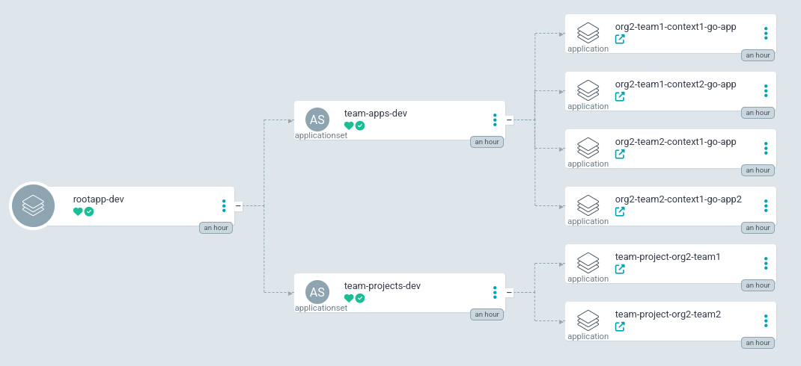

# gitops-example-iac-argocd-apps

A chart to demonstrate ArgoCD application deployments from tenant ArgoCD instances using a flat file structure/[monorepo](https://argo-cd.readthedocs.io/en/stable/operator-manual/applicationset/Use-Cases/#use-case-monorepos).

This example assumes the following:

- Each OpenShift cluster correlates to a different SDLC environment, for example dev, test and prod.
- Application IAC are maintained by development teams.
- Developments teams belong to Organizations within a company. These could also be considered business units.
- Each Organization maintains an ArgoCD instance deployed per cluster.
- Every Organization has an operations team to review changes submitted by pull request processes from development teams before allowing changes to SDLC environments.
- All SDLC environments are synced using a flat file structure/[monorepo](https://argo-cd.readthedocs.io/en/stable/operator-manual/applicationset/Use-Cases/#use-case-monorepos) from the default branch's `HEAD` Git commit pointer.
- Cluster administrators can simply bootstrap tenant ArgoCD instances and deploy a root application (rootapp) into them (to instantiate the monorepos) using the default Openshift GitOps instance. 

## Setup

A cluster admin simply needs to deploy the Openshift GitOps operator...

```sh
helm upgrade -i openshift-gitops-operator setup/helm/openshift-gitops-operator -n openshift-operators
```

and then bootstrap the rootapp correlating to the intended SDLC environment...

```sh
helm upgrade -i bootstrap-rootapp setup/helm/bootstrap-rootapp -n openshift-gitops -f setup/helm/bootstrap-rootapp/values-dev.yaml
```

## Explanation

### Openshift GitOps ArgoCD Bootstrap RootApp:

The Openshift GitOps argocd instance service account has been given cluster admin privileges to provision namespaces and bootstrap tenant argocd rootapp deployments per organization.
A cluster admin needs to maintain the [./setup/helm/bootstrap-rootapp/values.yaml](./setup/helm/bootstrap-rootapp/values.yaml) yaml file with a list of orgs and repo urls for each org's monorepo. Each repoURL should have a `helm/rootapp` and `helm/argocd` chart to instantiate the tenant argocd and applications.



### Org1 ArgoCD RootApp:

This is an argocd instance to manage many applications for many teams within the Org1 organization. It was bootstrapped from the Openshift GitOps instance.



### Org2 ArgoCD RootApp

This is an argocd instance to manage many applications for many teams within the Org1 organization. It was bootstrapped from the Openshift GitOps instance.



### Bootstrapping

The code within the [./setup/helm](./setup/helm) directory is intended to be maintained by a cluster admin and instantiated by the [./setup/helm/bootstrap-rootapp](./setup/helm/bootstrap-rootapp) chart once per SDLC OpenShift cluster.

```text
[tbox@fedora gitops-example-iac-argocd-apps]$ tree setup
setup
└── helm
    ├── bootstrap
    │   ├── Chart.yaml
    │   ├── templates
    │   │   ├── applications-bootstrap-org-argocd.yaml
    │   │   ├── applications-bootstrap-org-namespaces.yaml
    │   │   ├── applications-bootstrap-rootapp.yaml
    │   │   ├── applicationsets-bootstrap-team-namespaces.yaml
    │   │   └── _helpers.tpl
    │   └── values.yaml
    ├── bootstrap-rootapp
    │   ├── Chart.yaml
    │   ├── templates
    │   │   ├── application-bootstrap-rootapp.yaml
    │   │   └── _helpers.tpl
    │   ├── values-dev.yaml
    │   ├── values-prod.yaml
    │   ├── values-test.yaml
    │   └── values.yaml
    ├── openshift-gitops-operator
    │   ├── Chart.yaml
    │   ├── templates
    │   │   ├── clusterrolebinding-openshift-gitops-controllers-cluster-admin.yaml
    │   │   ├── group-cluster-admins.yaml
    │   │   ├── _helpers.tpl
    │   │   └── subscription-openshift-gitops-operator.yaml
    │   └── values.yaml
    ├── org-namespaces
    │   ├── Chart.yaml
    │   ├── templates
    │   │   ├── _helpers.tpl
    │   │   └── namespace-argocd.yaml
    │   └── values.yaml
    └── team-namespace
        ├── Chart.yaml
        ├── templates
        │   ├── _helpers.tpl
        │   └── namespace.yaml
        └── values.yaml
```

When new orgs need to be added to the SDLC cluster, a cluster-admin simply needs to maintain the [./setup/helm/bootstrap/values.yaml](./setup/helm/bootstrap/values.yaml) file and changes will propagate automatically by the rootapp re-syncing...

```text
[tbox@fedora gitops-example-iac-argocd-apps]$ cat ./setup/helm/bootstrap/values.yaml
cluster:
  name:
orgs:
  - name: org1
    repoURL: https://github.com/trevorbox/gitops-example-iac-argocd-apps.git
  - name: org2
    repoURL: https://github.com/trevorbox/gitops-example-iac-argocd-apps.git
```

### Org MonoRepo

The org monorepo is the responsibility of the organizations operations team and needs to contain its own `helm/argocd` and `helm/rootapp` helm charts since the bootstrapping from Openshift Gitops expects these paths. The rootapp can then instantiate the `helm/applications` chart to deploy tenant apps. Notice that there is also a `helm/appproject` chart used for dynamically generating AppProjects based on a folder structure.

```text
[tbox@fedora gitops-example-iac-argocd-apps]$ tree helm/
helm/
├── applications
│   ├── Chart.yaml
│   ├── templates
│   │   ├── applicationset-team-apps.yaml
│   │   ├── applicationset-team-projects.yaml
│   │   └── _helpers.tpl
│   └── values.yaml
├── appproject
│   ├── Chart.yaml
│   ├── templates
│   │   ├── appproject.yaml
│   │   └── _helpers.tpl
│   └── values.yaml
├── argocd
│   ├── Chart.yaml
│   ├── templates
│   │   ├── argocd.yaml
│   │   └── _helpers.tpl
│   └── values.yaml
└── rootapp
    ├── Chart.yaml
    ├── templates
    │   ├── application-rootapp.yaml
    │   └── _helpers.tpl
    └── values.yaml
```

The ApplicationSet [./helm/applications/templates/applicationset-team-projects.yaml](./helm/applications/templates/applicationset-team-projects.yaml) uses a [Git Generator Directories](https://argo-cd.readthedocs.io/en/stable/operator-manual/applicationset/Generators-Git/#git-generator-directories) subtype to dynamically create AppProjects based on a directory path.

```yaml
...
  generators:
    - git:
        repoURL: 'https://github.com/trevorbox/gitops-example-iac-argocd-apps.git'
        revision: HEAD
        directories:
          - path: {{ printf "clusters/%s/orgs/%s/teams/*" .Values.cluster.name .Values.org.name }}
...
```

The ApplicationSet [./helm/applications/templates/applicationset-team-apps.yaml](./helm/applications/templates/applicationset-team-apps.yaml) uses a [Git Generator Files](https://argo-cd.readthedocs.io/en/stable/operator-manual/applicationset/Generators-Git/#git-generator-files) subtype to dynamically create Applications based yaml files within an expected directory path.

```yaml
...
  generators:
    - git:
        repoURL: 'https://github.com/trevorbox/gitops-example-iac-argocd-apps.git'
        revision: HEAD
        files:
          - path: {{ printf "clusters/%s/orgs/%s/teams/*/contexts/*/apps/*.yaml" .Values.cluster.name .Values.org.name }}
...
```

Each ApplicationSet references a path structure where teams would be responsible for submitting pull requests to for changing their application's deployment code reference throughout different SDLC environments.

```text
[tbox@fedora gitops-example-iac-argocd-apps]$ tree clusters
clusters
├── dev
│   └── orgs
│       ├── org1
│       │   └── teams
│       │       ├── team1
│       │       │   └── contexts
│       │       │       ├── context1
│       │       │       │   └── apps
│       │       │       │       └── go-app.yaml
│       │       │       └── context2
│       │       │           └── apps
│       │       │               └── go-app.yaml
│       │       └── team2
│       │           └── contexts
│       │               └── context1
│       │                   └── apps
│       │                       ├── go-app2.yaml
│       │                       └── go-app.yaml
...
├── prod
...
└── test
...
```

Next notice the parameters within each file. Each file name will translate to the final deployed app name in the namespace defined by the directory structure of were the parameter file is placed `<org>-<team>-<context>`.

We want each app to use the Git [Commit Pinning](https://argo-cd.readthedocs.io/en/stable/user-guide/tracking_strategies/#commit-pinning) deployment strategy.

```text
[tbox@fedora gitops-example-iac-argocd-apps]$ cat clusters/dev/orgs/org1/teams/team1/contexts/context1/apps/go-app.yaml 
source:
  repoURL: https://github.com/trevorbox/gitops-example-iac-go.git
  targetRevision:  e9420bfd904eb26c08a94b9222a7c0c67adac430
  path: deploy/helm/app
  helm:
    valuesFile: values.yaml
```
